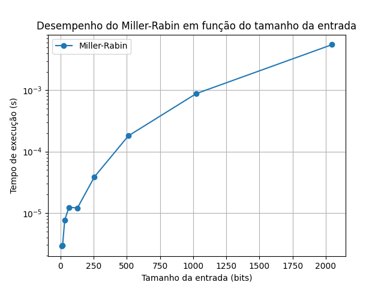
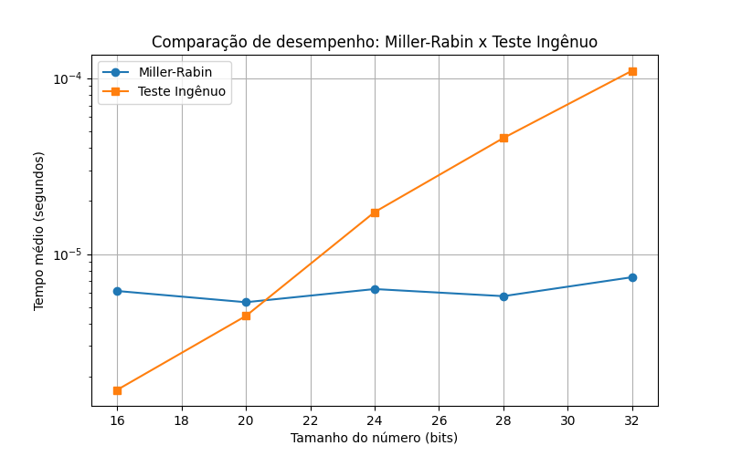
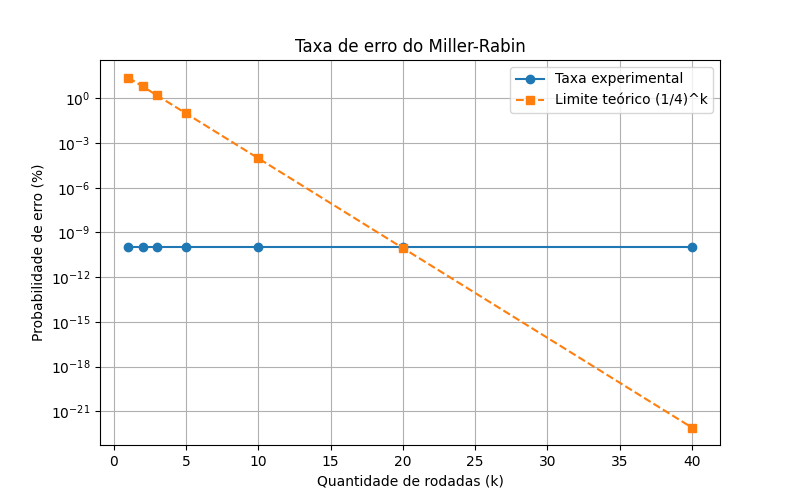

# Teste de Primalidade de Miller-Rabin

Trabalho da disciplina de Fundamentos de Matemática para Ciência da Computação II (FMCC2), sobre o algoritmo de Miller-Rabin para verificar se um número é primo.

## O que é o algoritmo

O Miller-Rabin é um teste probabilístico de primalidade: em vez de testar todos os divisores possíveis até a raiz de `n` (o que fica inviável para números grandes), ele usa aritmética modular para decidir, com alta probabilidade, se `n` é primo ou composto.

A ideia parte do Pequeno Teorema de Fermat: se `n` é primo e `a` é coprimo com `n`, então `a^(n-1) ≡ 1 (mod n)`. O Miller-Rabin refina isso escrevendo `n - 1 = 2^s * d`, com `d` ímpar, e testando se, para uma base `a`:

- `a^d ≡ 1 (mod n)`, ou
- `a^(2^r * d) ≡ -1 (mod n)` para algum `0 ≤ r < s`

Se nenhuma das duas condições vale, `a` é uma testemunha de que `n` é composto. Como o teste pode errar (classificar um composto como primo) com probabilidade no máximo 1/4 por rodada, repetimos com várias bases diferentes para reduzir esse erro exponencialmente — com 10 rodadas, por exemplo, a chance de erro cai para cerca de 1 em 1 milhão.

Esse é o teste usado na prática para gerar os primos grandes usados em RSA e outros esquemas de chave pública, já que testar primalidade por divisão direta seria lento demais nesses tamanhos.

## Estrutura do projeto

```
.
├── algoritmo
│   ├── decomposicao.py       # escreve n-1 como 2^s * d
│   ├── miller_rabin.py       # teste principal
│   ├── testemunha.py         # verifica se uma base é testemunha de composição
│   └── main_miller_rabin.py
├── testes
│   ├── testes_basicos.py
│   ├── testes_carmichael.py  # casos difíceis (números de Carmichael)
│   ├── testes_de_estresse.py
│   └── comparacao.py
├── graficos
│   ├── desempenho.py         # tempo x tamanho do número
│   ├── comparacao.py         # Miller-Rabin x método ingênuo
│   └── erro.py               # taxa de erro observada
├── utils/                    # imagens dos gráficos gerados
├── main.py
└── requirements.txt
```

## Como rodar

Requisitos: Python 3.10+, `sympy` e `matplotlib`.

```bash
pip install -r requirements.txt
python main.py
```

O `main.py` abre um menu:

```
1 - Testar um número com Miller-Rabin
2 - Gráfico de desempenho (bits x tempo)
3 - Gráfico de taxa de erro (números de Carmichael)
4 - Comparação com o método ingênuo
5 - Rodar todos os gráficos
6 - Rodar todos os testes
0 - Sair
```

## Resultados

**Desempenho.** Medimos o tempo médio de execução para números de diferentes tamanhos (em bits). O crescimento observado acompanha a complexidade teórica de `O(k log n)` por rodada.



**Miller-Rabin vs. método ingênuo.** Comparamos com a abordagem de testar divisores até `√n`. A diferença fica evidente à medida que o número de bits cresce — o método ingênuo se torna rapidamente inviável, enquanto o Miller-Rabin continua rápido.



**Taxa de erro com números de Carmichael.** Números de Carmichael são compostos que passam no teste de Fermat para quase todas as bases, então são um bom caso de teste para ver se o Miller-Rabin realmente detecta a composição. Rodamos o teste com diferentes quantidades de rodadas e medimos a taxa de falsos positivos.



## Integrantes

- Thalles Gabriel Saraiva de Lira Silva
- João Raphannely Medeiros Silva
- Hilbert Machado Gomes
- Mateus Soares da Rocha Cordeiro
- Eva Braga Santos